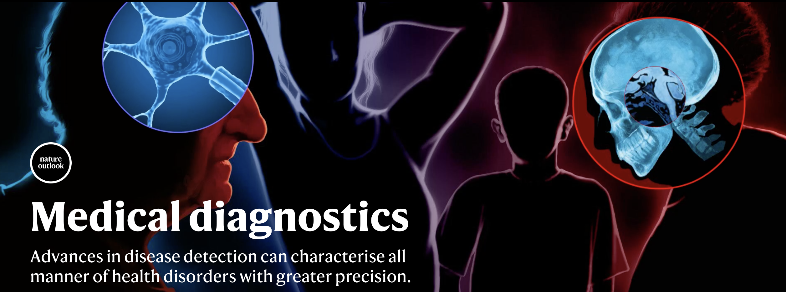
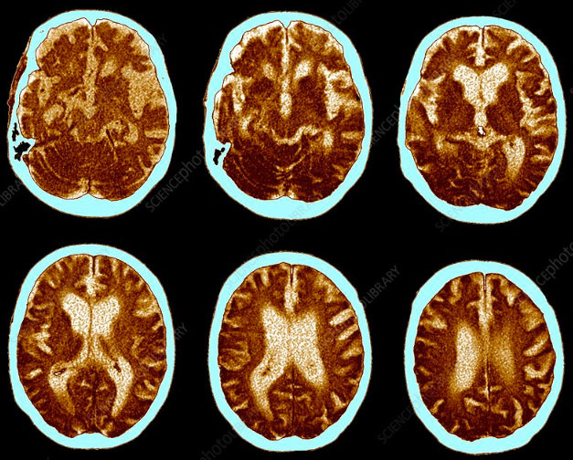
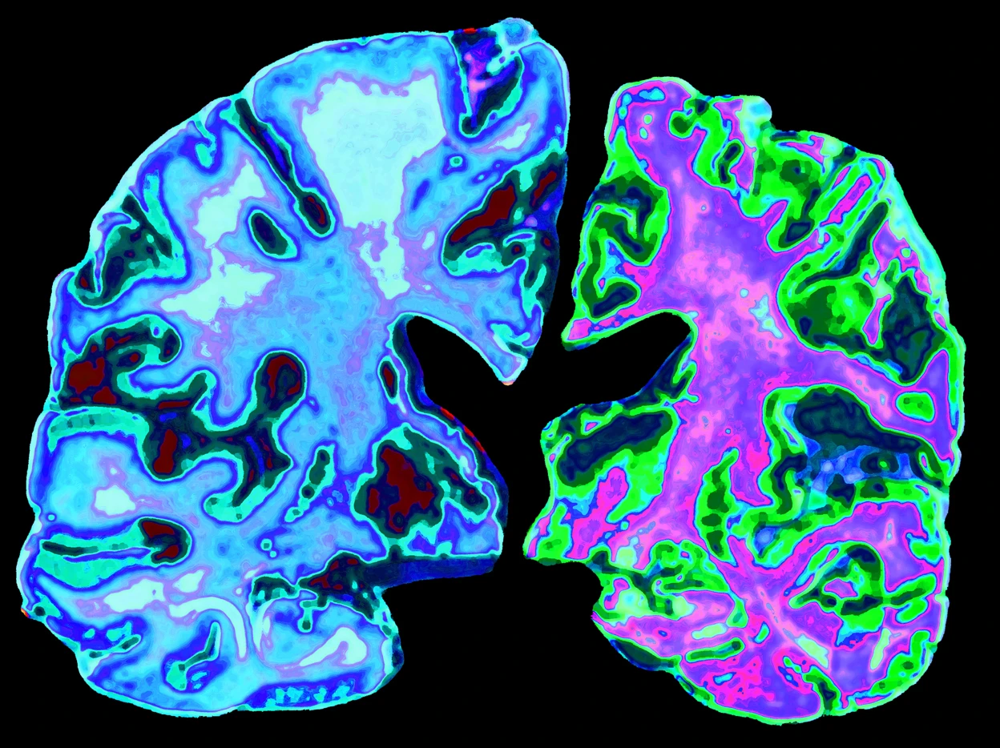
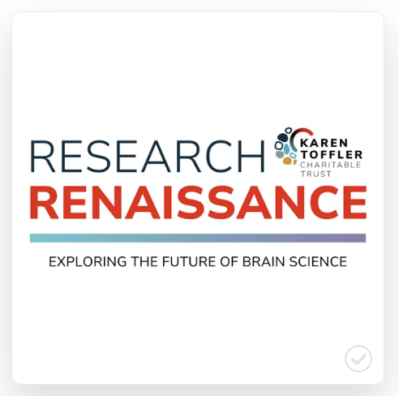
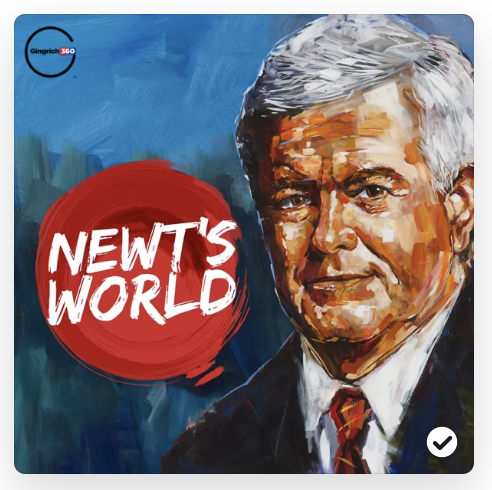

## Research

---
### Using AI to spot Alzheimer's disease

  Our Nature Communications paper entitled <a href="https://www.nature.com/articles/s41467-025-62590-4">AI-driven fusion of multimodal data for Alzheimer’s disease biomarker assessment</a> was highlighted by Boston University. Click <a href="https://www.bumc.bu.edu/camed/news-events/articles/2025/new-ai-tool-to-predict-markers-of-alzheimers-disease/">here</a> for more details.

---
### Medical diagnostics

   Our paper entitled <a href="https://www.nature.com/articles/s41591-024-03118-z">AI-based differential diagnosis of dementia etiologies</a> was included in the Nature portfolio on medical diagnostics. Click <a href="https://www.nature.com/immersive/medical-diagnostics/index.html">here</a> for more details.

---
### AI for easier and faster dementia diagnosis

   A press release highlighting our article on a multimodal deep learning model for differential diagnosis of dementia, published in Nature Medicine in June 2024, was featured on The Brink, a platform that showcases the latest news and research from Boston University. Click <a href="https://www.bu.edu/articles/2024/this-ai-software-can-make-diagnosing-dementia-easier-for-doctors/">here</a> for more details.

---
### Research highlight in Nature 

  
  Our paper published in Nature Medicine in July 2024 on an AI model for differential dementia diagnosis was highlighted by the journal Nature. Click <a href=" https://www.nature.com/articles/d41586-024-02202-1">here</a> for more details.

---
### Podcast on AI tools for dementia 

   Check out our episode on the Research Renaissance podcast, where we discuss building AI tools for dementia diagnosis, hosted by the Karen Toffler Charitable Trust and released in July 2024. Click  <a href=" https://podcasts.apple.com/us/podcast/research-renaissance-exploring-the-future-of/id1735997150?i=1000661644448">here</a> for more details.

---
### Briefing on our research in Nature Medicine 

   This research briefing, published in July 2024, accompanies our research paper, also published in July 2024, in Nature Medicine, which presents an AI model for differential diagnosis of dementia. Click  <a href="https://doi.org/10.1038/s41591-024-03147-8">here</a> for more details.

---
### Podcast on neurological research 

   Check out our episode on Newt's World, the podcast hosted by former Speaker of the House Newt Gingrich, where we sat down in October 2023 to discuss the exciting possibilities of AI in neurological research and how these tools can be developed to improve efficiency in patient care. Click  <a href="https://podcasts.apple.com/us/podcast/newts-world/id1452065072?i=1000632167791">here</a> for more details.

---
### Clubhouse discussion on our latest work 

   Our research on a deep learning model that utilizes multimodal data to assess Alzheimer's disease dementia, published in Nature Communications in June 2022, was featured in a discussion on Clubhouse. Click  <a href="https://www.clubhouse.com/room/PN9Rgp66?utm_medium=ch_room_xerc&utm_campaign=j24X6ivwc0EnmCitvMfvdw-349164">here</a> for more details.

---
### Technology for dementia diagnosis

   A press release highlighting our article on a multimodal deep learning model for assessing Alzheimer's disease dementia, published in Nature Communications in June 2022, was featured on The Brink, a platform that showcases the latest news and research from Boston University. Click <a href="https://www.bu.edu/articles/2022/two-technologies-that-can-make-diagnosing-dementia-easier-for-doctors-and-patients/">here</a> for more details.

---
### Clinical grade machine learning tools for Alzheimer's disease 

   Profile featuring our work with the Karen Toffler Charitable trust. Click <a href="https://tofflertrust.org/dr-vijaya-kolachalama/">here</a> for more details.

---
### Deep learning algorithm outperforms experts in making Alzheimer's disease diagnosis 

   A press release highlighting our article on an interpretable deep learning model for assessing Alzheimer's disease, published in Brain in June 2020, was featured on The Brink, a platform that showcases the latest news and research from Boston University. Click <a href="https://www.bu.edu/articles/2020/deep-learning-algorithm-outperforms-experts-in-making-alzheimers-diagnosis//">here</a> for more details.

